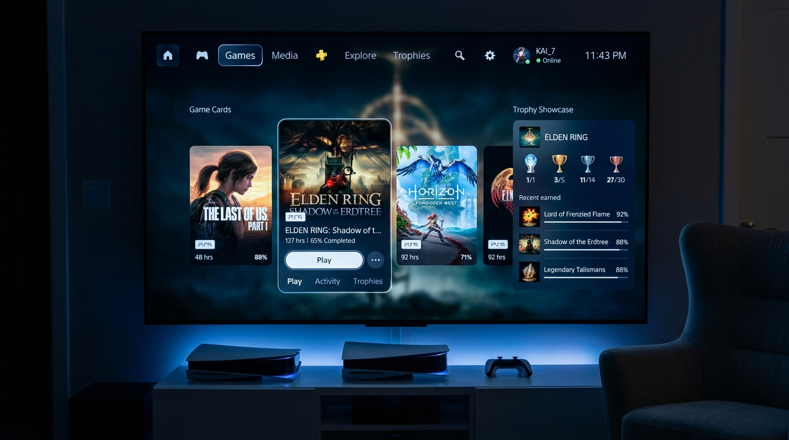
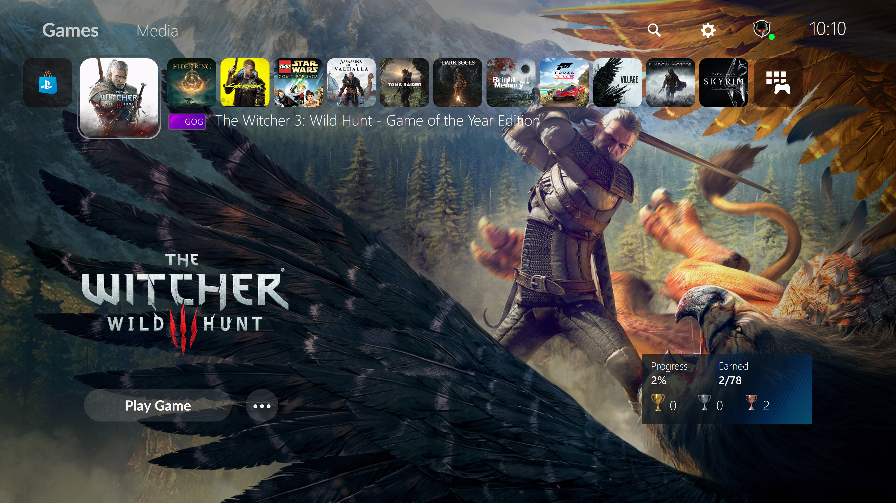
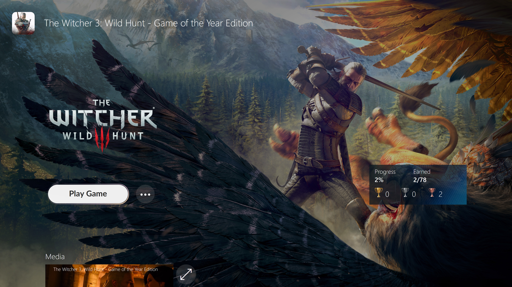
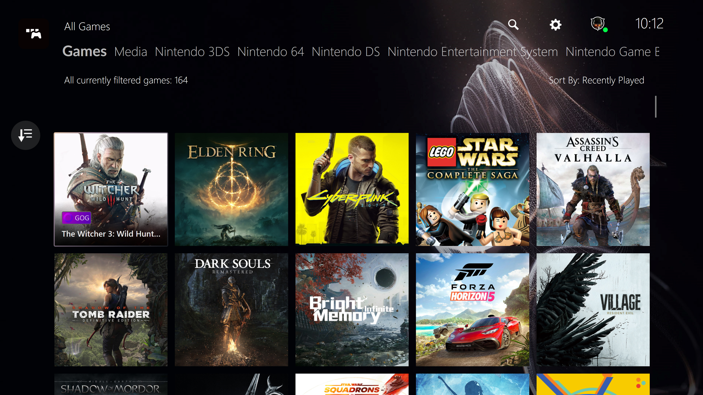
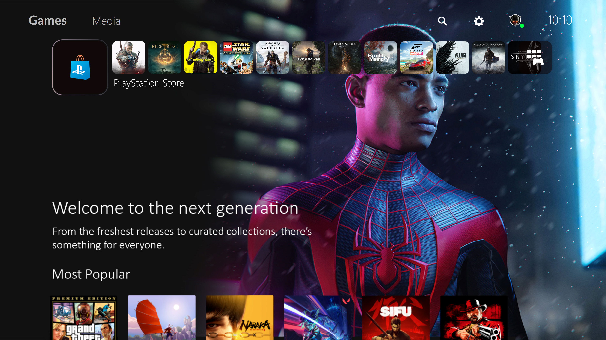
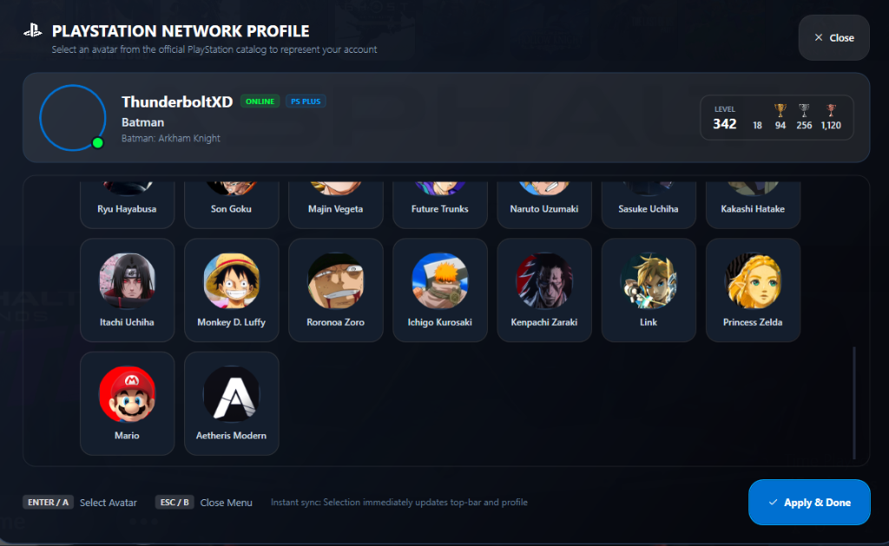

# Aetheris PS5 — Clean PlayStation-Inspired Fullscreen Theme for Playnite

<div align="center">



[](https://playnite.link)
[](https://github.com/thunderbolt66-wav/Aetheris-Playnite-Skin)
[](LICENSE)

*A clean, luminous, PlayStation 5-inspired fullscreen experience crafted for modern gaming PCs, handhelds, and TV setups.*

</div>

---

## 🎮 Overview

**Aetheris** takes inspiration from the sleek architecture of the PlayStation 5 operating system and elevates it into a clean, minimalist, high-contrast OLED-grade UI for Playnite Fullscreen Mode.

Designed with crisp typography, smooth translucent glass cards, luminous focus rings, and streamlined navigation, **Aetheris** delivers a true next-generation console aesthetic on Windows without visual clutter.

---

## ✨ Features

- **Official PlayStation 5 Login & User Selection Screen (v1.3.0)**:
  - Exact recreation of the iconic *"Welcome Back to PlayStation / Who's using this controller?"* screen.
  - **Dynamic PS5 Ambient Animation**: Real-time floating stardust bokeh orbs with smooth sinusoidal hover motion, warm diagonal light rays, and specular gold shimmer.
  - **Dual Card Selection**: PlayStation **"Add User"** circular guest card alongside the active Player Profile card.
  - **Active Controller Status**: Authentic controller icon and player `#1` indicator.
  - **Seamless Two-Way Integration**: Log in directly with `ENTER` / `X` or launch avatar customization via **Options** / **Switch User**.
- **Interactive Profile Gamertag Editor**:
  - Edit your player name dynamically directly inside the PlayStation profile menu.
  - Real-time two-way synchronization between your profile card, modal banner, and top-bar PlayStation header.
- **Authentic PS5ish Motion & Animation Suite**:
  - **Fluid Modal Spring Transitions**: Smooth `0.94 -> 1.0` spring-pop scaling with cubic easing and cinematic fade-in when opening profile settings.
  - **Dynamic Card Pop Scale**: Instant `1.0 -> 1.12` focus pop on hover or gamepad navigation with specular `#00A4FF` radiant glow rings.
- **PS5 Startup Boot Loading Screen**: Authentic PlayStation first-time boot experience featuring high-res PlayStation vector emblem, ambient radiant blue pulse halo (`#400070D1`), and dual expanding wave rings on launch.
- **PS5 Profile & Avatar Customization Hub**:
  - Authentic PlayStation 5 modal glass card with online user banner, PS Plus badge, and trophy stats widget (Platinum, Gold, Silver, Bronze).
  - Expanded catalog of **37 curated HD avatars** with 100% verified character and game titles (Kratos, Peter Parker, Miles Morales, Cloud, Tifa, Aerith, Zack, Snake, Kiryu, Majima, Joker, Geralt, Anime icons, and more).
  - **Instant Permanent Sync**: Switching avatars immediately syncs the top-bar avatar and profile header in real-time without resetting on close.
  - Full gamepad/controller and mouse navigation with smooth scrollable catalog.
- **Top-Bar PlayStation Header**: Clean status row with dedicated Search, Settings, Notifications, Profile Avatar, and system clock.
- **Deep OLED Dark Mode**: Handcrafted slate and obsidian dark backdrops (`#06090F` - `#0E1726`) tuned for OLED and HDR displays.
- **Translucent Glassmorphism**: Frosted glass surfaces with subtle inner specular borders (`#35FFFFFF`).
- **Dynamic Controller Focus**: Smooth scaling animations, radiant halo highlights, and ultra-responsive directional navigation.
- **Clean Audio & Visual Cue Support**: Built-in sound triggers and video backdrop integration for trailers and micro-trailers.
- **Native Extension Integration**:
  - 🏆 **SuccessStory** (PS-style trophy cards and achievement progress)
  - 🖼️ **Extra Metadata Loader** (Game logos, hero backgrounds, and video trailers)
  - 🛠️ **DKG Theme Modifier** compatible

---

## 📸 Screenshots

Genuine captures of **Aetheris PS5** running in Playnite Fullscreen mode:

### Home Screen & Game Details
| PlayStation 5 Home Carousel | Game Hub & Media View |
| :---: | :---: |
|  |  |

### Library & Navigation
| Full Library Grid | PlayStation Store & Explore |
| :---: | :---: |
|  |  |

### Profile & Customization Hub
| PSN Profile & Avatar Customizer |
| :---: |
|  |

---

## 📦 Installation

### Method 1: Direct Playnite Theme Package (`.pthm`)
1. Download the latest `Aetheris_93ede1bc-cf3c-47a0-9323-29f697d598f2_1_3_3.pthm` from the [Releases](https://github.com/thunderbolt66-wav/Aetheris-Playnite-Skin/releases) tab.
2. Double-click the `.pthm` file to install it directly into Playnite.
3. Open **Playnite Settings** (`F4`) ➔ **Appearance** ➔ **Fullscreen**.
4. Select **Aetheris PS5** as your theme and restart Playnite.

### Method 2: Manual Installation
1. Clone or download this repository.
2. Copy the `source` folder into your Playnite Fullscreen themes folder:
   ```
   %AppData%\Playnite\Themes\Fullscreen\Aetheris_93ede1bc-cf3c-47a0-9323-29f697d598f2
   ```
3. Restart Playnite and switch to **Aetheris PS5** in Fullscreen settings.

---

## ⚙️ Recommended Fullscreen Settings

For the ultimate PlayStation-like look:
- **Aspect Ratio**: 16:9 or 21:9 Ultrawide
- **Cover Art Aspect Ratio**: 1:1 or 2:3
- **Stretch Mode**: UniformToFill
- **Darken Uninstalled Games**: Enabled
- **Show Game Titles**: Enabled

---

## 🛠️ Extensions Recommended

To get the full console UI experience, install these free Playnite extensions via **Add-ons**:
- **Extra Metadata Loader**: Renders high-res transparent game logos and background video trailers.
- **SuccessStory**: Displays PlayStation-style trophy cards with bronze, silver, gold, and platinum counts.
- **UniPlaySong**: Plays background theme songs per game.

---

## 📄 License & Credits

- Licensed under the **MIT License**.
- Inspired by the architecture of [PS5ish](https://github.com/davidkgriggs/PS5ish) by David Griggs.
- Built for the open-source [Playnite](https://playnite.link) video game library manager by Josef Němec.
